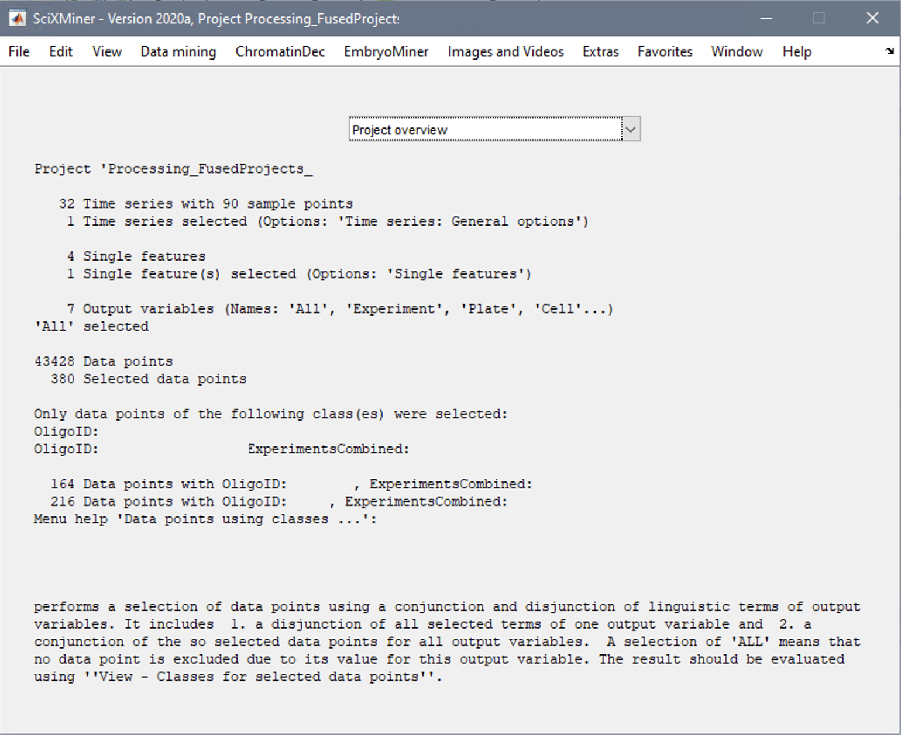
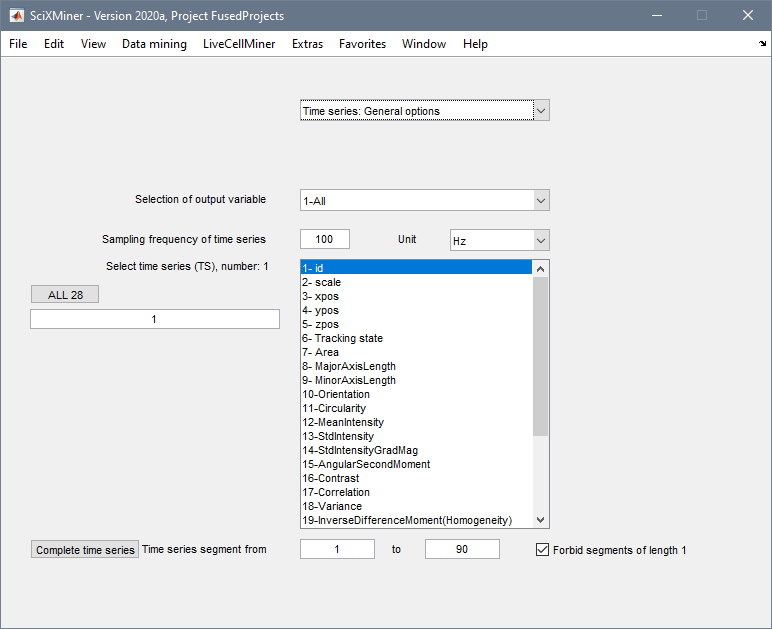
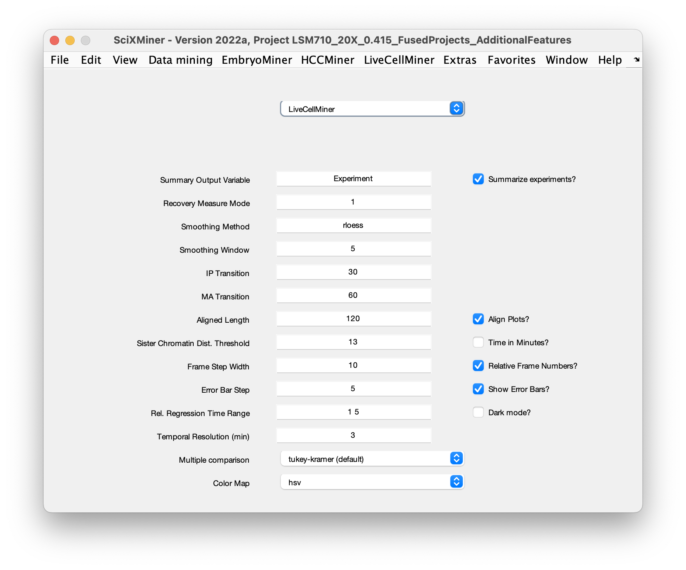
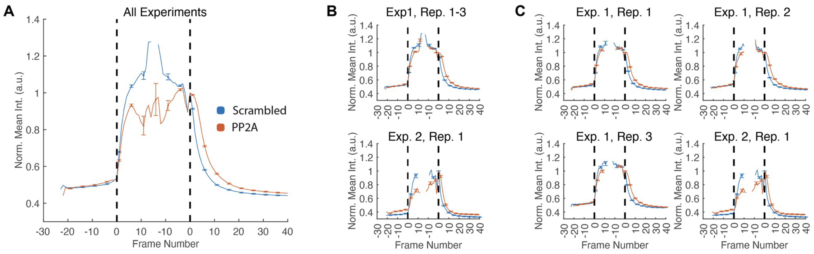
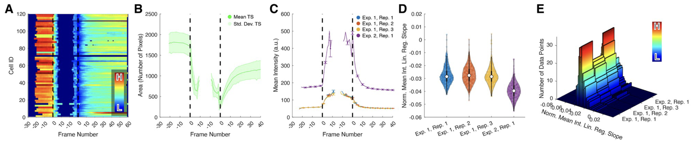

# LiveCellMiner Extension for SciXMiner 
[](https://zenodo.org/badge/latestdoi/269630703)

This repository contains the SciXMiner extension LiveCellMiner that is targeted to provide tools for a qualitative and quantitaitve analysis of cells undergoing mitosis. On the basis of time series of 2D microscopy images with a nuclear marker, cells are detected, tracked and analyzed. For valid division cycles, image patches of each frame are extracted and segmented to obtain quantitative features for each time point. Cells can then be temporally aligned using a set of manual and automatic tools, and various possibilities to visualize the data allow comparisons between different treatments.

## Prerequisites

The *LiveCellMiner* toolbox is an extension of the MATLAB toolbox SciXMiner [1] and assumes SciXMiner is properly installed on your system. Moreover, *LiveCellMiner* uses the third party tools XPIWIT [2] and Cellpose [3] that also have to be installed prior to using the software.

After having installed these requirements, download the *LiveCellMiner* toolbox and copy it into the *application_specials* folder of SciXMiner. Start SciXMiner using the command `scixminer` and enable the toolbox using *Extras -> Choose application-specific extension packages...* . Restart SciXMiner and you should see a new menu entry called *LiveCellMiner*.

To be able to use the external tools XPIWIT and Cellpose from within the toolbox (required to import new projects), the SciXMiner has to be provided with the paths to the third party software that should be used for processing. The paths can be set using the menu entry *LiveCellMiner -> Import -> Set External Dependencies*. In particular, these are the path to the executable of *XPIWIT* (e.g., *D:/XPIWIT/Bin/*) and the path to the Cellpose root folder (e.g., *I:/Software/Cellpose/*). Make sure to create a Python environment that is setup using the Cellpose environment.yml (e.g, using miniconda), activate the environment and start the MATLAB session from the Anaconda prompt to allow MATLAB calling the correct python environment when processing the data with Cellpose. Make sure to install an mx_net version that supports GPU processing, if you have a CUDA-capable GPU installed. This can tremendously decrease processing times.

## Example Data
Once you've successfully installed SciXMiner as well as the LiveCellMiner extension, you can already have a look at the example data provided in `Data/LiveCellMiner_ExampleData.zip`. Download the archive to your computer and extract its contents. You can now load the project file (`*.prjz` file in the root folder of the archive). The data set has already been synchronized and you can directly jump to the analysis functionality of LiveCellMiner as described in the *Data Selection and LiveCellMiner Settings* below. This example contains the data from *Figure 4 (last column)* and a good exercise to get started would be trying to recreate the plots of the figure as described in the following steps:

- Navigate to the time series selection using the dropdown menu the main window of SciXMiner by selecting the entry *Time series: General options*.
- Select the time series you want to display (e.g., *Area* or *MeanIntensity* as in Figure 4A,B).
- Select the output variable using the dropdown menu *Selection of output variable* and set it to *6-OligoID*. This will display different lines for each of the oligos.
- Now you can start plotting the selected time series, e.g., as line plots using *LiveCellMiner -> Show -> Comb. Line Plots* from the menu.

Note that rows C - G contain additional features that have to be precomputed first. 
- Figure 4C: This should display a normalized version of the mean intensity. Select the original time series *MeanIntensity* and then call *LiveCellMiner -> Process -> Perform Feature Normalization* from the menu and select *Interphase Mean*. You should now see a new time series called *MeanIntensity-NormalizedIntMean*. Select this one and plot it as before to generate the same plot as shown in Figure 4C.

- Figure 4D: This feature is a ratio of two other time series. In this case, the ratio of the minor and the major axis. Select the two time series called *MinorAxisLength* and *MajorAxisLength*, which should result in *8,9* showing up in the edit field on the right. Make sure to swap the order, i.e., modify the edit field entry to *9,8* as the order determines which time series is used as the numerator and the denominator, respectively. Finally, call *LiveCellMiner -> Process -> Compute Time Series Ratio* and visualize the new time series called *Ratio-MinorAxisLength-vs-MajorAxisLength* as before to reproduce Figure 4D.

- Figure 4F,G: These panels visualize single features, i.e., first navigate to the single features selection view using the dropdown menu the main window of SciXMiner by selecting the entry *Single features*. You'll notice that there is only one single feature present so far. To precompute some additional features, call *LiveCellMiner -> Process -> Compute Additional Single Features*. You can now select the feature *IPToMALength_Minutes* or *MeanOrientationDiffPMA* for visualization. Single features can be visualized either as box plots, violin plots or as histograms. Simply choose the visualization you like from the menu, e.g., *LiveCellMiner -> Show -> Comb. Violin Plots* to reproduce Figure 4F,G.

The example data set also contains the raw image snippets and their segmentation of all extracted cells, so you can also have a look at the current synchronization results using the manual synchronization gui that can be started using *LiveCellMiner -> Show -> Synchronization GUI*.

## Importing New Projects

The first required step is to extract the cell trajectories of single mitotic cells from the raw images. There are three steps involved in this process: 
1. detecting potential cell centroids in all frames separately [2], 
2. optionally run a CNN-based segmentation using Cellpose [3] on all frames individually for improved segmentation results, 
3. perform tracking of the detected centroids and identify cell trajectories that match the required length of the analysis time window (default: 30 frames before and 60 frames after the detected cell division). 

For each selected cell in each frame, a small patch (default: 96x96 px) is extracted from the raw images and segmented on-the-fly using a classical method based on binary thresholding and a seeded watershed or using the precomputed segmentation obtained with Cellpose [3]. The segmentation and the raw image snippet are then used to extract classical features (area, centroid, major/minor axes, orientation, circularity, mean intensity, intensity std. dev., std. dev. of the gradient magnitude) and a set of Haralick features [4] obtained from the grayscale covariance matrix with a discretization of the image to 64 intensity levels and by omitting all transitions from the background label to any other label (to focus only on texture features within each nucleus). Moreover, we extract CNN-based features for each image snippet using the features of the last fully-connected layer of a GoogLeNet [5] that was pretrained on the ImageNet database, yielding a 1000-dimensional feature vector for each cell in each frame. 
The tracked cells and associated classical features are stored in a SciXMiner project file (`*.prjz`) that can be opened with the SciXMiner MATLAB toolbox. The raw image snippets can be saved as individual 3D image files (3D TIFF, z-dimension represents time) and are additionally saved in a MATLAB file for easier access (`*_RawImagePatches.mat` and `*_MaskImagePatches.mat`). The CNN features are also saved as separate MATLAB file (`*_MaskedImageCNNFeatures.mat`).

The import of a single folder as well as a batch job that processes all subfolders in a provided directory can be started with *LiveCellMiner -> Import -> Import New Experiment*. The script lets you decide wheather to process a single position, an entire experiment with multiple positions or multiple experiments with all contained positions.

### Notes
- Make sure to have a consistent folder structure. The software assumes the following arrangement of your data: *Microscope / Experiment / Position / ImageFiles*. This information will be used to group the extracted data, e.g., to allow selecting only a subset of experiments, data that was acquired with a specific microscope or a particular position.
- Depending on the number of images per position, the processing can take a while and usually requires about 1-2 hours for one position depending on the hardware available.
- The pre-segmentation based on the external tool Cellpose, the writing of separate image snippets and potential image file selection filters can be enabled/disabled in the settings dialog that opens upon calling the script `callback_livecellminer_batch_processing.m`.


## Fusion of Projects
Projects are at first created for each experiment and position individually. To be able to analyze the data in a single project, e.g., to compare different positions, microscopes or experiments, the individual projects need to be fused. The fusion can initiated with the command *LiveCellMiner -> Import -> Fuse Experiments*. Again, you have the option to select at which level you want to perform the fusion (microscope, experiment, position). The fused project will be located in the root folder you selected and is indicated by the suffix `*_FusedProjects.prjz`.

## Cell Trajectory Synchronization
Due to the different durations of pro-, prometa- and metaphase, the *LiveCellMiner* toolbox provides different ways of synchronizing the individual trajectories. All functions related to the data synchronization are summarized in the menu entry *LiveCellMiner -> Align*. The following enumeration describes the individual menu items and their functionality:

- *LiveCellMiner -> Import -> Preload Image Snippets and CNN Features*: Call this function if you want to load all image patches and the associated CNN features at once in the beginning. The images are then hold in memory and are accessible faster. This is useful for manual annotations, to fluently switch between different cells. Moreover, it's required for the learning-based synchronization methods, as the decisions are made based on the pre-computed CNN features (see next point).

- *LiveCellMiner -> Align -> Perform Auto Sync*: This function automatically tries to identify the interphase -> prophase transition (IP) as well as the metaphase/early anaphase -> late anaphase transition (MA) points. These two transition points are used to align the different cell trajectories such that interphasic and postmitotic frames are aligned properly. There are currently three options for automatic alignment: 
    1. *Classical*: this approach uses the classical features area, circularity, mean intensity and intensity std. dev. to identify the interphase -> prophase transition by searching for two clusters that minimize the within-class variance using the temporally constrained combinatorial clustering (TC3) method [6]. The division time point that was identified during tracking is assumed to be the correct time point and we only shift it by one additional time point, if the identified division time point is still corresponding to early anaphase. This is accomplished by a heuristic that checks if the area of both daughter cells are smaller than the area before the division. If yes, the synchronization time point is increased by one frame. Otherwise, it's left unchanged as presumably no early anaphase was visible or the segmentation could already identify two separate objects.
    2. *Classical + Auto Rejection*: Same as before, but uses an LSTM network that was trained on sequences of CNN features to predict if the current cell is a valid mitotic trajectory or an erroneous track. Erroneous tracks are directly rejected.
    3. *LSTM + HMM + Auto Rejection*: Uses an LSTM network that was trained on sequences of CNN features to predict the synchronization time points as well as identifying which of the cell tracks are valid/invalid. The prediction of the synchronization time points is post-processed with a Hidden Markov Model (HMM) that only allows valid state transitions (e.g., state sequences 1 -> 2 -> 3 for a valid track or 0 for an invalid track). Transition probabilities are manually specified and based on the predicted states of the LSTM, the Viterbi algorithm is used to identify the most likely hidden state sequence.


- *LiveCellMiner -> Align -> Find Inconsistent Synchronizations*: This function selects all cells where the automatic synchronization was unsure or where the identified synchronization states are incomplete. The selection variable *ind_auswahl* of SciXMiner is set to these inconsistent cells and these cells can subsequently be corrected via the manual synchronization tool (see next point).

- *LiveCellMiner -> Show -> Auto-Sync Overview*: displays some information about the number of (presumably) correct synchronizations and the number of ambiguous/rejected tracks.

- *LiveCellMiner -> Show -> Synchronization GUI*: This menu item opens up a simple graphical user interface that can be used to manually identify the state transitions. It displays a set of 10 cells at a time, where two cells above one another are daughters, respectively. The annotation procedure is like this: (1) Left-click on the first frame considered as prophase to mark the interphase -> prophase transition and next, left-click on the first late anaphase frame to mark the meta-/early anaphase -> late anaphase transition. All intermediate frames are classified accordingly and the annotations on one of the daughter cells are directly copied to the other daughter to have a consistent alignment. To redo an annotation, simply start with the identification of the IP transition and the MA transition. If a complete trajectory should be rejected as either no mitotic event is present or if the tracking was erroneous, click on an arbitary frame of that cell with the right mouse button (both daughters should be highlighted in red afterwards). Stages are colored in green, magenta, cyan and red for inter, (pro, prometa, meta, early ana), (late ana, telo, inter) and incorrect cells, respectively. Use the arrow keys to switch to the previous/next 10 cells. The keys 1, 2, 3 toggle the visualization between raw, mask, masked raw images. It's usually advisable to start with the automatic synchronization and then focus on correcting only the errors. The following keyboard commands are available for the annotation GUI:
    - *1, 2, 3, 4, 5*: Toggles the visualization of raw, mask, raw+mask overlay. Options 4, 5 are only available if a second channel was analyzed (2nd channel raw and overlay of 1st and 2nd channel in red and green, respectively).
    - *Left Arrow*: Load previous montage
    - *Right Arrow* Load next montage
    - *Up Arrow* Mark current images as suitable training data and load next montage
    - *Down Arrow* Mark current images as unsuitable training data
    - *Left click*: Set IP and MA transition points
    - *Right click*: Reject the current cell track
    - *G*: Add currently visible cells to the confirmed ground truth (used for the LSTM classifier)
    - *H*: Show this help dialog with an overview of the available keyboard shortcuts.
    - Hint: In case key presses show no effect, left click once on the title bar of the figure window and try hitting the button again. This only happens if the window loses the focus.

- *LiveCellMiner -> Align -> Update LSTM Classifier:* Function to update the training database as well as the LSTM classifiers used for rejecting incorrect tracks and to perform the automatic synchronization. All cells that were manually checked via *Perform Manual Synchronization* and verified by confirming via the *Up Arrow*. If cells visualized in the *Perform Manual Synchronization* window should not contribute to the training data set, simply hit the *Down Arrow*. By default, visualized cells are not part of the training set, i.e., you have to explicitly mark them as being suitable as ground truth. This information is stored in the single feature `manuallyConfirmed` that determines if cells were manually verified (value 1) or not (value 0).  The classifier and regression LSTMs are then retrained on the updated list and saved in the SciXMiner toolbox folder (`autoSyncData.mat` and `autoSyncLSTMModel.mat`). The software will always ask for a name of the classifier when retraining and when being applied to the image data. So make sure to store separate classifiers, e.g., for different magnifications or microscope settings. Hint: to only annotate a selected set of cells, you can preselect the desired cells using *Edit -> Select -> Data points using classes...*.

, pro, prometa, meta and early anaphase (magenta), late ana, telo, interphase (cyan) and invalid trajectories (red).")

## Data Selection and LiveCellMiner Settings

An important aspect to analyze a particular subset of the data is data selection. This can be accomplished using the standard SciXMiner data selection procedures and most useful in this aspect is the class-based selection using *Edit -> Select -> Data points using classes ...* This opens up the dialog depicted in the following screenshot:

.")

Use these listboxes to select the subset of the data that you want to analyze in more detail. For instance, select experiments that were acquired with a particular microscope, a subset of OligoIDs, a specific experiment or individual plates. Also any combinations of these output variables can be used. It is also possible to manually add additional output variables using the standard procedure for SciXMiner using the variables `code_alle`, `zgf_y_bez` and `bez_code` (see official documentation [1]). After selection, the selected cell indices are summarized in the selection variable `ind_auswahl` and subsequent visualizations or manual corrections are only performed on the selected cells. Note that additional features are automatically computed for all cells to avoid missing feature values. The SciXMiner project overview shows the current selection as depicted in the following screenshot:



In addition to selecting data points (i.e., cells), it is possible to select which of the feature time series should be visualized. This can be performed in the dialog *Time series: General options*:



The listbox enumerates all available time series allows to select a time series for visualization, analysis or to compute additional features. It is also possible to select multiple time series by pressing the CTRL key while selecting. Each time series is then visualized separately.

The output variable *Selection of output variable* controls how the data are split for the visualization and uses the same classes as for the class-based data point selection, e.g., to group data points according to the same microscope, experiment, cell Id or oligoID. For instance, if *All* is selected, all cells are plotted in a single plot. If *Experiment* is selected, all cells corresponding to a single experiment are plotted in the same plot, with subplots for each of the experiments. Also useful is e.g., *OligoID* that allows to summarize the results of the same treatment. These selections affect all available visualizations. The two edit fields *Time series segment from* can be used to constrain the time window, e.g., to only focus on the first 40 time points for the manual synchronization. If you want to visualize the entire time series again, hit the *Complete time series* button.



- *Summary Output Variable*: Allows to specify which output variable should be used for grouping. This can be useful to summarize repeats of the same experiment but not the oligos of all experiments. Use *LiveCellMiner -> Process -> Add Repeats Output Variable* to specify the related repeats.
- *Recovery Measure Mode*: See documentation of the menu entry *LiveCellMiner -> Process -> Compute Rel. Recovery Time Series*.

- *Smoothing Method*: The smoothing method to be used for smoothing time series features. See valid options for the MATLAB function `smooth`.

- *Smoothing Window*: The smoothing window to be used for smoothing time series features.

- *IP Transition*: The position of the interphase -> prophase transition in the aligned visualizations. E.g. 30 means that all interphase frames are put before frame 30.

- *MA Transition*: The position of the metaphase -> anaphase transition in the aligned visualizations. E.g., 60 means that all phases following anaphase will be placed after frame 60.

- *Aligned Length*: The total number of frames in the aligned plots. IP Transition and MA Transition are within this range. E.g., 0 -> IP Transition -> MA Transition -> end.

- *Sister Chromatin Dist. Threshold*: Used to refine the synchronization time point based on the distance of the sister chromatin masses. The value is provided in microns. Note that it's important that projects were processed with the correct physical spacing set, as otherwise length and area measures are not comparable.

- *Frame Step Width*: The interval between frame labels (x-axis of the plots). Only effective if *Relative Frame Numbers?* is enabled.

- *Error Bar Step*: The frequency at which error bars are plotted. Used to avoid cluttered visualizations. Only effective if *Show Error Bars?* is enabled.

- *Rel. Regression Time Range*: Range of frames relative to the synchronization time point that will be used for computing regression-based single features to be visualized as box plots. E.g., 1-5 would indicate to use frames 1-5 after the mitotic event for computing the slope of the regression line. 

- *Summarize Experiments?*: If enabled, the oligos of different experiments will be summarized.

- *Align Plots?*: If enabled, the synchronization time points will be used for visualization. Otherwise, the original unaligned time series will be used.

- *Relative Frame Numbers?*: If enabled, frame numbers in all plots are displayed relative to the IP and MA transition points. The transition points are labeld with 0 and frames before/after the transitions are negative/positive values that indicate the number of frames before/after teh event. If disabled, absolute frame numbers will be used.

- *Show Error Bars?*: If enabled, error bars will be plotted in line plots.

- *Dark Mode?*: If enabled, dark color scheme is used for visualizations.


## Visualizations
In addition to the standard visualization possibilities available in SciXMiner, all visualizations specific for the *LiveCellMiner* toolbox are summarized in the menu entry *LiveCellMiner -> Show*. The visualizations include:

- *Heatmaps*: Show heatmaps of the selected time series. Separate Documentation/Screenshots are created for each of the time series and subplots are created according to the selected output variable and the optional *Summarize experiments* setting that can be adjusted in the *Time series: General options* and *LiveCellMiner* dialogs, respectively.

- *Line Plots*: Show mean +/- std.dev. line plots of the selected time series. Separate Documentation/Screenshots are created for each of the time series and subplots are created according to the selected output variable and the optional *Summarize experiments* setting that can be adjusted in the *Time series: General options* and *LiveCellMiner* dialogs, respectively.

- *Comb. Line Plots*: Show average time series +/- std. err. of the selected time series. Separate Documentation/Screenshots are created for each of the time series. Instead of subplots, all lines are summarized in a single plot for direct comparison. Averages and std. err. are summarized according to the selected output variable and the optional *Summarize experiments* setting that can be adjusted in the *Time series: General options* and *LiveCellMiner* dialogs, respectively. Error bars can be optionally turned on/off by toggling the *Show Error Bars?* checkbox and the frequency of error bars can be controlled with the edit field *Error Bar Step* which are both located in the *LiveCellMiner* settings dialog.

- *Comb. Box Plots*: Shows box plots of the selected single features. Note that single features are not available in the initial project and have to be computed separately (see section on *Data Processing*). Values are summarized according to the selected output variable and the optional *Summarize experiments* setting that can be adjusted in the *Single features* and *LiveCellMiner* dialogs, respectively.

- *Comb. Histogram Plots*: Shows histogram plots of the selected single features. Note that single features are not available in the initial project and have to be computed separately (see section on *Data Processing*). Values are summarized according to the selected output variable and the optional *Summarize experiments* setting that can be adjusted in the *Single features* and *LiveCellMiner* dialogs, respectively.

- *Auto-Sync Overview*: prints an overview of the auto-sync performance. Note that this feature only works if the project already contains OligoIDs (see *LiveCellMiner -> Process -> Add OligoID Output Variable*).

- *Synchronization GUI*: See respective paragraph in the *Cell Trajectory Synchronization* section.

The selected data points used for visualization can be grouped in different ways. All selected cells with the same value of the output variable (see section on *Data Selection*) will be plotted in a single figure. Moreover, the *LiveCellMiner* settings dialog allows to enable/disable *Summarize experiments?*, where data points of different experiments but with the same output variable are summarized. This can be useful, e.g., to visualize the response of a particular treatment across experiments. When disabled, all experiments are visualized individually. The three panels in the following figure were obtained for a selection of four experiments, where experiments 1-3 were repeats and experiment 4 is a separate experiment also using a different modality (confocal instead of a widefield microscope). The settings for combining the experiments (from left to right) are: (1) *Summarize experiments=true*, *Summary Output Variable=Experiment*, (2) *Summarize experiments=false*, *Summary Output Variable=ExperimentsCombined*, (3), *Summarize experiments=false*, *Summary Output Variable=Experiment*.



The following figure showcases the four different visualization possibilities (left to right, top to botom) with the *OligoID* output variable selected, the *MeanIntensity* time series and the *Summarize experiments* option enabled to merge cells of different experiments that were treated identically:



Finally, the settings *Align plots?* in the *LiveCellMiner* settings dialog uses the identified synchronization time points for spatial alignment if enabled (default) and the unaligned time series if disabled. The edit field *Aligned Length* specifies the number of frames to use for the aligned heat maps and line plots (default value: 120), and the values *IP Transition* and *MA Transition* indicate at which frame the respective transitions identified during the manual/auto synchronization should be placed (default values: 30 and 60 respectively). 

## Data Processing
The *LiveCellMiner* toolbox also includes a few additional algorithms for postprocessing the time series and to extract single features from the time series. The following functions are currently available:

- *Compute 2nd Channel Features*: If a project has an additional second channel and if this information was extracted during the import of the project, additional features can be computed on this channel. The segmentation is initialized with the nucleus segmentation of the first channel and can be modified using morphological operators dilation and erosion. The parameter dialog allows to specify the mode (extension, shrinking and toroidal), the structuring element to use (see *strel* definition of MATLAB) and the radius of the structuring element. *Extension* dilates the nucleus segmentation, *Shrinking* performs an erosion of the nucleus segmentation and *Toroidal* dilates the nucleus segmentation and then subtracts the original segmentation to have a toroidal region surrounding the initial segmentation. All morphological operations are based on the selected structuring element. The additional time series are added to the time series overview and can be visualized/analyzed in the same way as all other time series. It is also possible to extract multiple 2nd channel time series with different structuring elements. Currently, the features mean intensity, max intensity, intensity standard deviation and the mean intensity ratios between first and second channel are computed. If additional features should be added, you can implement them in the file `callback_livecellminer_extract_second_channel_features.m`.

- *Compute Additional Single Features*: Combines multiple frames of selected features to single features that can be analyzed using the boxplot and histogram visualizations. Currently, the following single features are included: *IPToMALength_Frames* (number of frames between the interphase-prophase and the metaphase-anaphase transition), *IPToMALength_Minutes* (same as before but scaled with the time step in minutes), *InterphaseMeanIntensity* (average intensity of each cell measured in the interphase frames), *AccumulatedOrientationDiffPMA* (sum of orientation angle changes between the start of the prophase and the time point before the chromatin masses separate).

- *Compute Linear Regression Slope*: Uses a specified time window and the currently selected time series to compute a linear regression on the feature values of the selected frames for each of the cells. The slope of the regression curve is stored as a single feature for each of the cells. This can be used, e.g., to estimate the initial recovery rate of time series features right after the division. The time window of interest can be selected in the *LiveCellMiner* settings dialog and is named *Rel. Regression Time Range* and the values are relative with respect to the division event, i.e., selecting a range of 1 - 5 would select the five frames after the division.

- *Compute Rel. Recovery Time Series*: This function computes a new time series based on the currently selcted time series. The average value of the interphasic frames is identified and different options to compute the recovery time series can be selected in the *LiveCellMiner* settings dialog (*Recovery Measure Mode*). The available options are: 
    1. Current vs. Target Ratio: Ratio of the current value and the average value of the interphase. Larger than 1 if the current value is higher than the target value and less than 1 if the current value is smaller than the target value.
    2. Always Increasing Ratio: similar as (1) but always <= 1, i.e., it is ensured that the larger value is always put in the denominator.
    3. Signed Percentage Deviation: the signed percentage deviation of the current value with respect to the interphase average value.
    4. Absolute Percentage Deviation: the absolute percentage deviation of the current value with respect to the interphase average value.


- *Add OligoID Output Variable*: This function adds a new output variable containing the OligoIDs, i.e., each cell is associated with an ID that uniquely identifies the oligo/treatement that was applied to the cell. The information used for this function is crawled from a text file that has to be located in the same folder as the experiment raw data and should have the same name as the experiment folder with the extension *.txt*. Inside of the text file, a three-column CSV file is expected with the specifiers in the first line and a separate line for each of the positions of the experiment. For instance the file content for 16 positions and four different treatments could look like this:

```
Position   OligoID GeneSymbol
0001	Oligo1	Oligo1
0002	Oligo1	Oligo1
0003	Oligo1	Oligo1
0004	Oligo1	Oligo1
0005	OLI-2	OLI-2
0006	OLI-2	OLI-2
0007	OLI-2	OLI-2
0008	OLI-2	OLI-2
0009	olig_3	olig_3
0010	olig_3	olig_3
0011	olig_3	LSD1-6
0012	olig_3	olig_3
0013	TT2T	TT2T
0014	TT2T	TT2T
0015	TT2T	TT2T
0016	TT2T	TT2T
```
Always make sure that you use consistent OligoIDs. Any spelling or case error will be considered as a different treatment and can not be combined with the corresponding treatment later on.

- *Add Repeats Output Variable*: Allows you to specify which experiments should be combined. For instance, if you have three repeats of one experiment, you can specify the same unique ID for all of these experiments, to optionally summarize the measurements. See options *Summarize experiments?* and *Summary Output Variable* in the *LiveCellMiner* settings dialog.

- *Select Data Points using Feature Range*: can be used to select data points based on a value range of a single feature. This can, for instance, be useful to select only cells for comparison that exhibit comparable mean intensities during the interphase.

- *Perform Feature Normalization*: Normalizes the selected time series by dividing each frame's value by the value after the cell division, such that the first late ana time point is assigned the value 1 and all other positions' values are relative to this time point.

- *Smooth Selected Time Series*: Smooths the selected time series with the method selected in the *LiveCellMiner* settings dialog. See documentation of the MATLAB function *smooth* for details on the available methods. Moreover, the size of the smoothing window can be adjusted in the edit field *Smoothing Window* located in the *LiveCellMiner* settings dialog.

# Statistical Analysis
*LiveCellMiner* allows to apply several statistical tests to selected single features and time series. Note that there is no checking performed if a statistical test is reasonable to be applied for the selected set of features, *i.e.*, familarize yourself with the methodology and make sure to select the appropriate statistical test for your application.

The following functions are included:
- *Test for Normal Distribution*: Performs a test for each of the selected output classes if the feature follows a normal distribution (the respective test method to use can be specified in the SciXMiner dropdown menu *Data mining: Statistical options*).
- *Apply Two-Sample t-Test (parametric, SF)*: Performs a two-sample t-test (*e.g.*, to compare a single feature of two different oligos) on a selected single feature (SF). This also produces result tables in `*.csv` format as output with a matrix of pairwise tests (p-values and boolean test result if hypothesis was rejected or not). The result tables are placed in the same folder as the SciXMiner project resides in.
- *Apply Wilcoxon Rank Sum Test (non-parametric, SF*: Same as the Two-Sample t-Test but using a Wilcoxon rank sum test instead.
- *Apply ANOVA (parametric, SF)* and *Apply Kruskal-Wallis (non-parametric, SF)*: Possibility to compute an ANOVA or Kruskal-Wallis on the selected single feature (*e.g.* to compare multiple oligos including a visualization of the confidence intervals and the resulting significances). The multiple testing correction method to use can be specified in the *LiveCellMiner* settings dialog as well and is named *Multiple comparison*. See https://de.mathworks.com/help/stats/multcompare.html for further information.
- *Compute Median Absolute Deviation (MAD, SF)*: Computes the global median value of the selected feature across all classes and the individual median values of each class. The average deviation of the individual median values to the global median (MAD) is computed and used as a threshold. Hits that exhibit a median value that deviates more than 3xMAD can be considered as strong hits.
- *Apply Two-Way ANOVA*: Possibility to perform two-way ANOVA with interaction, where the dependent variable is the selected time series feature and the independent variables are the currently selected classes (*e.g.*, oligos, experiments, microscope, ...) *vs.* a set of selected time points (*e.g.*, an interphase time point, the MA-transition time point and a later value a few minutes after MA-transition defined by the user). Note that the time point selection uses absolute frame numbers in this case. To get the absolute frame numbers displayed in the line plots and heat map visualizations, make sure to uncheck the *Relative Frame Numbers?* checkbox located in the general *LiveCellMiner* settings dialog. The multiple testing correction method to use can be specified in the *LiveCellMiner* settings dialog as well and is named *Multiple comparison*. See https://de.mathworks.com/help/stats/multcompare.html for further information.

Note that all above-mentioned statistical tests make use of the general *SciXMiner* selection, *i.e.*, you can use the *Edit -> Select -> Data Points using Classes ...* menu entry to perform the desired selection of cells to be used for the statistical analysis. Moreover, make sure to specify the correct output variable (dropdown menu entitled *Selection of output variable* that you can find in the *Single features* and *Time series: General options* dialog). 

## References:
1. Mikut, R., Bartschat, A., Doneit, W., Ordiano, J. Á. G., Schott, B., Stegmaier, J., ... & Reischl, M. (2017). The MATLAB Toolbox SciXMiner: User's Manual and Programmer's Guide. arXiv preprint arXiv:1704.03298.

2. Bartschat, A., Hübner, E., Reischl, M., Mikut, R., & Stegmaier, J. (2016). XPIWIT—an XML Pipeline Wrapper for the Insight Toolkit. Bioinformatics, 32(2), 315-317.

3. Stringer, C., Michaelos, M., & Pachitariu, M. (2020). Cellpose: A Generalist Algorithm for Cellular Segmentation. bioRxiv.

4. Haralick, R. M., Shanmugam, K., & Dinstein, I. H. (1973). Textural Features for Image Classification. IEEE Transactions on Systems, Man, and Cybernetics, (6), 610-621.

5. Szegedy, C., Liu, W., Jia, Y., Sermanet, P., Reed, S., Anguelov, D., ... & Rabinovich, A. (2015). Going Deeper with Convolutions. In Proceedings of the IEEE Conference on Computer Vision and Pattern Recognition (pp. 1-9).

6. Zhong, Q., Busetto, A. G., Fededa, J. P., Buhmann, J. M., & Gerlich, D. W. (2012). Unsupervised Modeling of Cell Morphology Dynamics for Time-Lapse Microscopy. Nature Methods, 9(7), 711-713.
